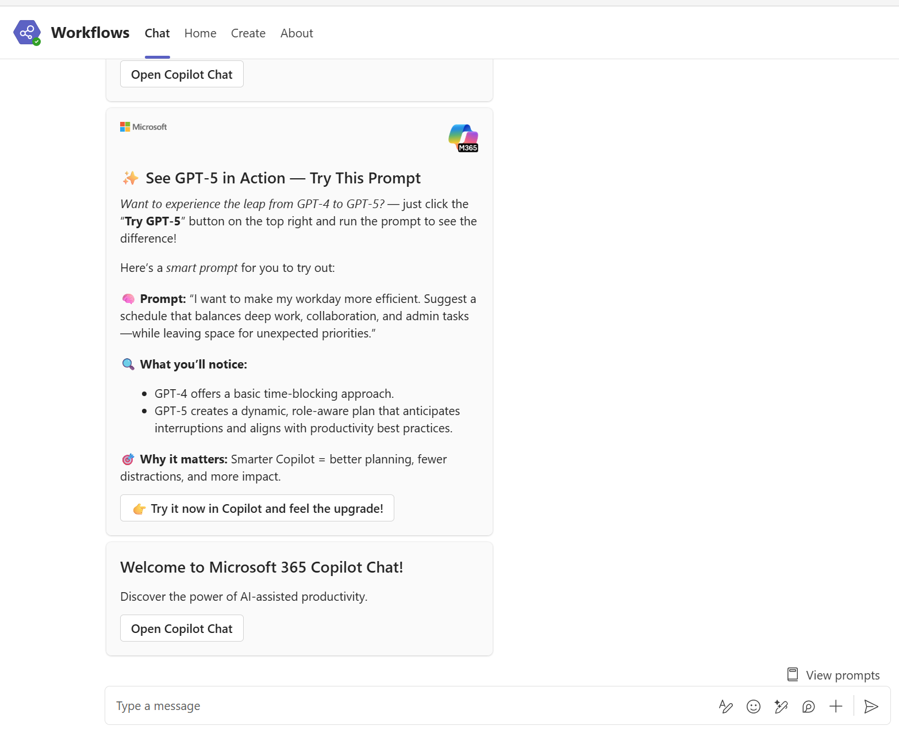

# Power Automate Deployment Guide

## Copilot Chat Promotion Campaign

This guide walks you through deploying the Power Automate flow that sends Copilot Chat promotional Adaptive Cards to users in Microsoft Teams.

---

## 1. What this flow does

High-level:

1. You manually trigger the flow.
2. You choose:

   * **Campaign Week** (1–4)
   * **User Type** (`Licensed` / `NonLicensed`)
3. The flow picks the right Adaptive Card JSON using a **Switch** on `CardSelector`.
4. It reads a list of UPNs from an **Excel table**.
5. For each UPN, it uses **Teams → Post card in a chat or channel** to send the card in a 1:1 chat.

 The flow runs under the identity of the owner / runner.

---

## 2. Prerequisites

Before you start, you need:

* [ ] A Microsoft 365 account with **Teams** and **Power Automate**
* [ ] Permission to create / edit flows in your environment
* [ ] Access to a **SharePoint document library or OneDrive** location to store the Excel file
* [ ] Permission to send Teams messages to your target users

> 💡 Only **standard connectors** are used (Excel Online (Business), Microsoft Teams). No Premium HTTP connector.

---

## 3. Prepare the Excel user list

You’ll use a single Excel table as the source of recipients.

1. Create an Excel workbook in **SharePoint** or **OneDrive for Business**.
   Example:
   `power-automate-solution/TargetUsers.xslx`

2. In the workbook, create a table (Insert → Table) and name it something simple, e.g. `Users`.

3. Add target user to excel:

   | Column Name | Type                  | Required | Notes                               |
   | ----------- | --------------------- | -------- | ----------------------------------- |
   | `UPN`       | Text (General/String) | Yes      | User email, e.g. `user@contoso.com` |


4. Save the workbook.

---

## 4. Import the Power Automate flow

1. Download the exported flow solution ZIP from this repo
   Example: `power-automate-solution/CopilotChatPromotion_1_0_0_3.zip`.

2. Go to [Power Automate](https://make.powerautomate.com).

3. In the left nav, select **Solutions**

4. Click **Import** (or **Import solution**) and upload the ZIP file.

5. Walk through the import wizard:

   * If prompted, select your **connections** for:

     * **Excel Online (Business)**
     * **Microsoft Teams**
   * Click **Import** and wait for it to complete.

6. After import, you should see a flow named something like **Send Copilot Promotion Cards**.

---

## 5. Configure the flow

Open the flow in **Edit** mode and check these pieces.

### 5.1 Manual trigger inputs

The trigger is **Manually trigger a flow** with two text inputs:

* **Campaign Week** (`text`) – optional
* **User Type** (`text_1`) – optional

These map to:

* `text` → week number (`1`, `2`, `3`, `4`)
* `text_1` → user type (`Licensed` or `NonLicensed`)

If both are empty, the flow falls back to a default card.

### 5.2 Card selector variable

The **Initialize CardSelector** action should use this expression as the value:

```json
if(
  or(
    empty(triggerBody()?['text']),
    empty(triggerBody()?['text_1'])
  ),
  'Default',
  concat(triggerBody()?['text_1'], '_Week', triggerBody()?['text'])
)
```

This gives values like:

* `Licensed_Week1`
* `NonLicensed_Week2`
* or `Default` when inputs are blank

### 5.3 Adaptive card JSON switch

There is a **Switch** action named `Select Adaptive Card` that switches on `CardSelector`.

Cases:

* `Licensed_Week1`
* `Licensed_Week2`
* `Licensed_Week3`
* `Licensed_Week4`
* `NonLicensed_Week1`
* `NonLicensed_Week2`
* `NonLicensed_Week3`
* `Default`

Inside each case there is a **Set variable** action that sets the `AdaptiveCardJson` variable to the full JSON for that card.

<mark> You can edit the card text or design.</mark>

### 5.4 Excel: List rows present in a table

1. Find the action **List rows present in a table** (Excel Online (Business)).
2. Configure:

   * **Location**: Your SharePoint/OneDrive location
   * **Document Library**: Where the file lives (if SharePoint)
   * **File**: Browse to your Excel workbook
   * **Table**: Select the table you created (e.g. `Users`)

No filter is required initially; the flow will loop all rows.

### 5.5 Apply to each + Post card in a chat or channel

The **Apply to each** loops over the Excel rows:

* **Output**: `value` from `List rows present in a table`

Inside the loop is the Teams action:

* **Action**: **Post card in a chat or channel**

Configure it like this:

* **Post as**: `Flow bot` (or your choice)

* **Post in**: `Chat with user`

* **Recipient**:
  Use dynamic content from the Excel row, e.g.:

  ```json
  item()?['UPN']
  ```

* **Message** type: **Adaptive Card**

* **Adaptive card** content: use the variable `AdaptiveCardJson`

Depending on the designer UI, you either:

* Paste `@{variables('AdaptiveCardJson')}` into **Adaptive card** (if it accepts expressions), or
* Use the **Expression** tab to insert `variables('AdaptiveCardJson')`.

Save the flow.

---

## 6. Running the campaign

### 6.1 Prepare your Excel list

* Add / update rows in the Excel table with one `UPN` per row.
* Save the file. (Excel Online autosave is fine.)

### 6.2 Trigger the flow

1. Go to **My flows** (or **Solutions → [solution name]**) in Power Automate.
2. Find **Send Copilot Promotion Cards (Teams)**.
3. Click **Run**.

You’ll see the manual trigger panel with:

* **Campaign Week** (optional, `1–4`)
* **User Type** (optional, `Licensed` or `NonLicensed`)

Examples:

* To send **Licensed, Week 1** card:

  * Campaign Week: `1`
  * User Type: `Licensed`
* To send the **default** card:

  * Leave both fields empty

Click **Run flow**.

The flow:

1. Picks the right card.
2. Reads every row from the Excel table.
3. Sends the card to each user’s Teams 1:1 chat.

---

## 7. Monitoring and troubleshooting

### 7.1 Run history

1. In the flow, open **Run history**.
2. Open a specific run to see:

   * `Initialize CardSelector` → check the computed value (`Licensed_Week2`, etc.)
   * `Select Adaptive Card` → correct case executed
   * `List rows present in a table` → number of rows
   * Each **Post card in a chat or channel** call inside **Apply to each**

### 7.2 Common issues

#### Flow fails in `Initialize_CardSelector`

* **Symptom**: Template expression error referring to `text` or `text_1`.
* **Cause**: Input names on the manual trigger don’t match.
* **Fix**: In the trigger:

  * First input’s internal name must be `text`
  * Second input’s internal name must be `text_1`
    (Rename carefully or recreate the inputs in the UI.)

#### No rows from Excel

* **Symptom**: `List rows present in a table` returns empty.
* **Causes**:

  * Wrong file/table selected
  * Table has no rows
* **Fix**:

  * Double-check the table name in Excel (Table Design → Table Name).
  * Confirm the connector points to the right file and table.

#### Some users don’t receive cards

* **Symptom**: Post action fails for specific rows.
* **Typical error**: user not found / invalid recipient.
* **Fix**:

  * Validate the `UPN` value in Excel.
  * Confirm those users have Teams and are in your tenant.

#### Throttling or long runs with large lists

* For very large sets (e.g. 10,000 users), consider:

  * Running the flow per department or region (filtered Excel views / separate files).
  * Enabling **Concurrency control** on the `Apply to each` with a safe degree of parallelism.

---

## 8. Campaign schedule (example)


| Week | Licensed Users Card       | Non-Licensed Users Card      |
| ---- | ------------------------- | ---------------------------- |
| 1    | GPT-5 intro (Chat prompt) | GPT-5 in Copilot Web         |
| 2    | Researcher agent          | Project plan review          |
| 3    | Prompt Like a CEO         | Multi-image comparison       |
| 4    | Prompt Coach              | (Optional, or repeat Week 1) |

You can re-run the flow weekly with different **Campaign Week** values and/or maintain different Excel lists per audience.

---

## 9. Security notes

* The flow runs as **you** (or the connection owner), not as an app.
* Recipients will see the message from <mark>Flow bot / your chosen posting option. </mark>

* Control who can:

  * Edit the flow
  * Edit the Excel file (which controls who gets the card)

---

## 10. Support

* Issues with the flow definition or instructions: open a GitHub issue on this repo.
* For connector-level errors (Excel / Teams), refer to:

  * Power Automate run history
  * Teams client / admin center logs if needed

---

